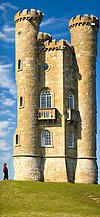

# Seam Carving in Rust

This project implements the seam carving algorithm in Rust, allowing for content-aware image resizing. The program takes an input image and removes seams to achieve a specified target width.

## Features

- Interactive command-line interface
- Computes energy maps for pixel importance
- Removes vertical seams to resize the image

## Usage

1. Place your input image in the src directory (default name: `input.jpg`).
2. Run the program.
3. Enter the desired target width when prompted.
4. The output image will be saved as `output.png`.

## Example

### Input Image

### Output Image

